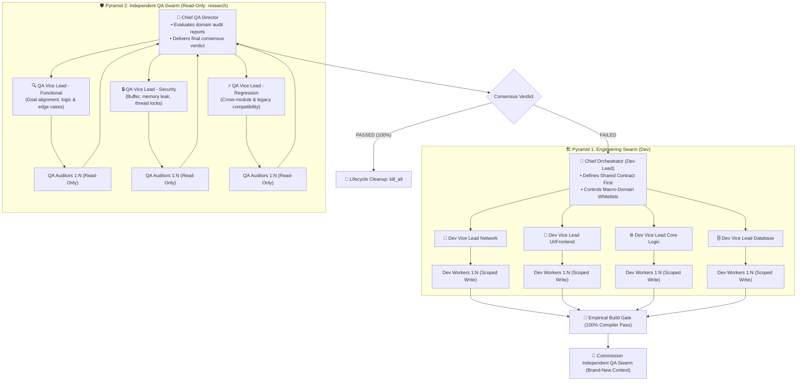

# 🚀 Antigravity Skills Collection

> **High-performance custom skills and agentic orchestration protocols for Google Antigravity (AGY).**  
> *คลังรวมทักษะขั้นสูงและสถาปัตยกรรมกระจายงาน SubAgent สำหรับ Google Antigravity*

---

## 🌐 Table of Contents / สารบัญ
- [English Overview](#-english-overview)
  - [Featured Skill: `/subagent` (Symmetric Dual-Pyramid)](#-featured-skill-subagent-symmetric-dual-pyramid)
  - [The Dual-Pyramid Architecture Diagram](#-the-dual-pyramid-architecture-diagram)
  - [Key Safety Features](#-key-safety-features)
  - [Installation & Quick Start](#-installation--quick-start)
- [🇹🇭 ภาพรวมภาษาไทย](#-ภาพรวมภาษาไทย)
  - [สกิลเด่น: `/subagent` (พีระมิดคู่สมมาตร)](#-สกิลเด่น-subagent-พีระมิดคู่สมมาตร)
  - [วิธีติดตั้งและนำไปใช้งาน](#-วิธีติดตั้งและนำไปใช้งาน)

---

## 🌐 English Overview

### 🏛️ Featured Skill: `/subagent` (Symmetric Dual-Pyramid)
**Symmetric Dual-Pyramid Multi-SubAgent Protocol (3-Tier Engineering Swarm VS 3-Tier Independent QA Swarm)**

Designed for enterprise-scale software engineering, this protocol creates an equal balance between **high-velocity parallel development** and **rigorous, zero-bias quality assurance**.



---

### 🛡️ Key Safety Features

1. **Symmetric 3-Tier Dual-Pyramid:** Both Dev and QA operate in structured 3-tier hierarchies (Chief ➔ Vice Leads ➔ 1:N Workers), ensuring institutional rigor and zero blindspots.
2. **Two-Tier File Whitelisting:**
   - *Macro Level:* Chief locks department boundaries (UI never touches DB).
   - *Micro Level:* Dev Vice Leads partition non-overlapping files among workers. Zero edit collisions guaranteed.
3. **Strict Read-Only for QA Pyramid:** All QA agents are instantiated with `TypeName: "research"`, guaranteeing zero accidental code mutations during review.
4. **Empirical Build Verification Gate:** Code must pass actual compiler/build commands before handoff to the QA Pyramid.
5. **Zero-Bias Red-Teaming:** The QA Pyramid is spawned with 100% fresh context, completely independent of the Dev Pyramid to eliminate confirmation bias.
6. **Zero-Hanging Cleanup (`kill_all`):** Immediate process termination upon task approval, preventing zombie background processes and UI spinner hangs.

---

### 📦 Installation & Quick Start

#### 1. Install via Git:
Clone this repository directly into your Antigravity skills directory:
```powershell
# Windows PowerShell
git clone https://github.com/skszone01/antigravity-skills.git "$env:USERPROFILE\.gemini\config\skills"
```
Or copy specific skill directories (e.g. `subagent/`) into `~/.gemini/config/skills/`.

#### 2. Usage in Antigravity:
Simply type the slash command in the chat:
```text
/subagent
```
*(Or provide specific instructions: `/subagent Implement new inventory exchange modal with packet validation`)*

---

## 🇹🇭 ภาพรวมภาษาไทย

### 🏛️ สกิลเด่น: `/subagent` (พีระมิดคู่สมมาตร)
**สถาปัตยกรรม Symmetric Dual-Pyramid (ทีมพัฒนา 3 ชั้น VS ทีมตรวจรับงาน QA 3 ชั้น)**

ออกแบบมาเพื่อสร้างความสมดุลสูงสุดระหว่าง **"การเขียนโค้ดที่รวดเร็วขนานกัน"** กับ **"การตรวจสอบที่เข้มงวด 100% ไร้อคติ"**

#### จุดเด่นสำคัญ:
- **โครงสร้างพีระมิดคู่สมมาตร (Dual-Pyramid):**
  - *พีระมิดที่ 1 (ฝ่ายพัฒนา):* หัวหน้าใหญ่ Dev ➔ รองฯ Dev (Network/UI/Logic/DB) ➔ ลูกน้องโค้ดเดอร์ 1:N
  - *พีระมิดที่ 2 (ฝ่ายตรวจรับงาน QA):* ประธาน Chief QA ➔ รองฯ QA (Functional/Security/Regression) ➔ ลูกน้องผู้ตรวจสอบ 1:N (Read-Only 100%)
- **ระบบคุมกรรมสิทธิ์ไฟล์ 2 ชั้น (Two-Tier File Whitelist):** ตัดปัญหาโค้ดเซฟทับกัน 100% ทั้งระหว่างฝ่ายและระหว่างลูกน้องในทีมเดียวกัน
- **ด่านตรวจคอมไพล์จริง (Empirical Build Gate):** ต้องคอมไพล์ผ่าน 100% ก่อนส่งมอบงานให้พีระมิด QA
- **มติเอกฉันท์ไร้อคติ (Zero-Bias Consensus):** พีระมิด QA ทั้งชุดถูกตั้งขึ้นมาใหม่เอี่ยมเสมือน Red Team ภายนอก
- **เคลียร์ทรัพยากรทันที (Zero-Hanging Cleanup):** บังคับเรียก `kill_all` ปิด SubAgent ทุกตัวในทั้งสองพีระมิดทันทีเมื่องานจบ

---

## 📜 License
MIT License. Free to use, modify, and distribute for Antigravity agents and developers.
