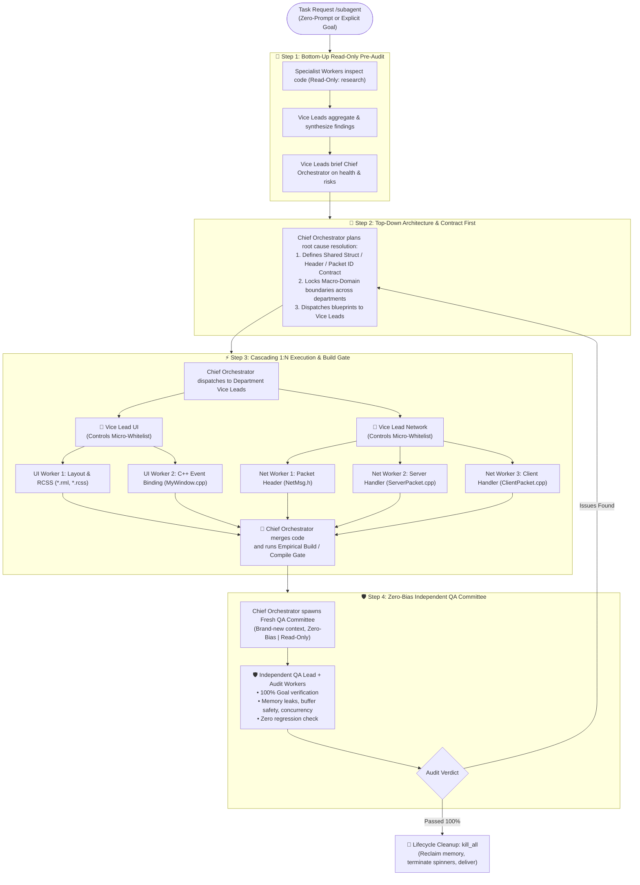

# 🚀 Antigravity Skills Collection

> **High-performance custom skills and agentic orchestration protocols for Google Antigravity (AGY).**  
> *คลังรวมทักษะขั้นสูงและสถาปัตยกรรมกระจายงาน SubAgent สำหรับ Google Antigravity*

---

## 🌐 Table of Contents / สารบัญ
- [English Overview](#-english-overview)
  - [Featured Skill: `/subagent`](#-featured-skill-subagent)
  - [The 3-Tier Architecture & 4-Step Protocol](#-the-3-tier-architecture--4-step-protocol)
  - [Key Safety Features](#-key-safety-features)
  - [Installation & Quick Start](#-installation--quick-start)
- [🇹🇭 ภาพรวมภาษาไทย](#-ภาพรวมภาษาไทย)
  - [สกิลเด่น: `/subagent`](#-สกิลเด่น-subagent)
  - [วิธีติดตั้งและนำไปใช้งาน](#-วิธีติดตั้งและนำไปใช้งาน)

---

## 🌐 English Overview

### 🏛️ Featured Skill: `/subagent`
**Advanced 3-Tier Enterprise Multi-SubAgent Hierarchy Protocol (Chief Orchestrator ➔ Vice Leads ➔ 1:N Specialist Workers)**

Designed for complex, large-scale software engineering tasks, this protocol prevents code collisions, eliminates confirmation bias, and guarantees clean process lifecycle termination without UI hanging.



---

### 🛡️ Key Safety Features

1. **Two-Tier File Whitelisting (Macro & Micro Partitioning):**
   - **Macro-Level (Chief Orchestrator):** Partitions departmental boundaries (e.g., UI never touches DB).
   - **Micro-Level (Vice Leads):** Each Vice Lead controls multiple workers (1:N) with non-overlapping file whitelists, completely eliminating race conditions and edit overwrite conflicts.
2. **Autonomous Zero-Prompt Auto-Assessment:**
   - Invoking `/subagent` without parameters triggers an automatic 4-vector scan (Git diffs, build errors, crash logs, code smells) to self-diagnose and dispatch workers without manual prompt drafting.
3. **Strict Read-Only Audit Phases (Steps 1 & 4):**
   - Enforces `TypeName: "research"` in audit stages to guarantee zero accidental code mutations.
4. **Empirical Build Verification Gate:**
   - Mandates running actual build/compiler commands before handover to QA.
5. **Zero-Bias Independent Audit Committee:**
   - Uses a fresh, un-biased agent context in Step 4 to review combined PR diffs, eliminating developer confirmation bias.
6. **Zero-Hanging Cleanup (`kill_all`):**
   - Enforces immediate termination of all child subagents and descendants upon task completion to prevent zombie processes and lingering UI spinners.

---

### 📦 Installation & Quick Start

#### 1. Install via Git:
Clone this repository directly into your Antigravity skills directory:
```powershell
# Windows PowerShell
git clone https://github.com/skszone01/antigravity-skills.git "$env:USERPROFILE\.gemini\config\skills"
```
Or copy specific skill directories (e.g. `subagent/`) into `~/.gemini/config/skills/`.

#### 2. Usage in Antigravity:
Simply type the slash command in the chat:
```text
/subagent
```
*(Or provide specific instructions: `/subagent Implement new inventory exchange modal with packet validation`)*

---

## 🇹🇭 ภาพรวมภาษาไทย

### 🏛️ สกิลเด่น: `/subagent`
**ระบบควบคุมและกระจายงาน 3-Tier Enterprise Hierarchy (หัวหน้าใหญ่ ➔ รองหัวหน้า ➔ ลูกน้องหลายตัว 1:N)**

ออกแบบมาเพื่อแก้ไขปัญหาการพัฒนาโปรเจกต์ขนาดใหญ่ที่มีหลายโมดูล โดยยึดหลัก **"ความถูกต้อง 100% มาก่อนความเร็ว"** และตัดปัญหาโค้ดเซฟทับกันอย่างสมบูรณ์

#### จุดเด่นสำคัญ:
- **โหมดประเมินงานอัตโนมัติ (Autonomous Zero-Prompt):** พิมพ์แค่ `/subagent` ลอยๆ ระบบจะสแกนสถานะ Git, Build Error, และ Log ล่าสุด เพื่อแตกงานและส่งช่างเฉพาะทางเข้าประจำจุดให้เอง
- **ระบบล็อกกรรมสิทธิ์ไฟล์ 2 ชั้น (Two-Tier File Whitelist):**
  - *ระดับหัวหน้าใหญ่:* แบ่งแดนระหว่างฝ่าย (UI, Network, Logic, Database)
  - *ระดับรองหัวหน้า:* คุมลูกน้องหลายคนในฝ่ายตนเอง (1:N) โดยล็อกไฟล์ของลูกน้องแต่ละคนไม่ให้ชนกัน
- **ด่านตรวจคอมไพล์จริง (Empirical Build Gate):** ต้องคอมไพล์ผ่านจริง 100% ก่อนส่งตรวจรับงาน
- **คณะกรรมการตรวจรับงานอิสระ (Zero-Bias Independent Audit):** ใช้ Agent ชุดใหม่เอี่ยมตรวจโค้ดเสมือนคนนอก ไร้อคติ
- **เคลียร์ทรัพยากรทันที (Zero-Hanging Cleanup):** บังคับเรียก `kill_all` ปิด SubAgent ทุกตัวทันทีเมื่องานจบ ป้องกัน UI หมุนค้าง

---

## 📜 License
MIT License. Free to use, modify, and distribute for Antigravity agents and developers.
