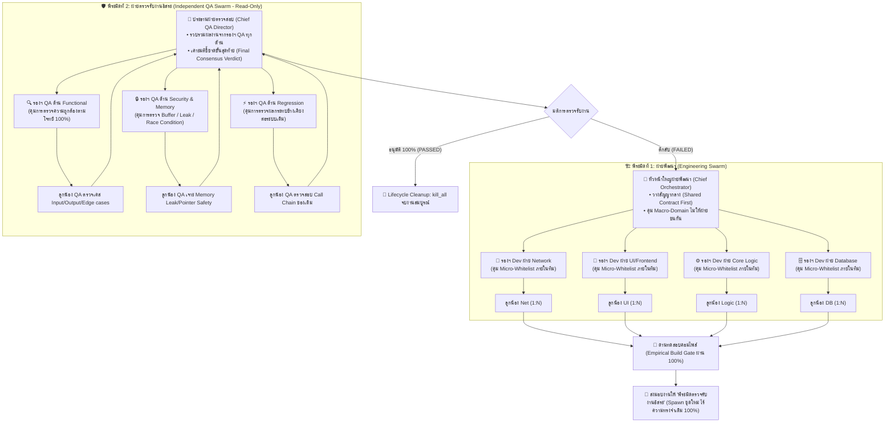

# 🏛️ Symmetric Dual-Pyramid Multi-SubAgent Protocol
## (สถาปัตยกรรมพีระมิดคู่แบบสมมาตร: ทีมพัฒนา 3 ชั้น VS ทีมตรวจรับงาน QA 3 ชั้น)

ระบบนี้ถูกออกแบบตามโครงสร้างองค์กรวิศวกรรมซอฟต์แวร์ระดับโลก (Symmetric Enterprise Engineering & Quality Architecture) โดยแบ่งองค์กรออกเป็น **2 พีระมิดที่ทำงานสมมาตรกัน (Dual-Pyramid)** เพื่อสร้างความสมดุลระหว่าง **"ความเร็วในการพัฒนา"** กับ **"ความเข้มงวดในการตรวจสอบ 100%"**

---

## 🔺 โครงสร้าง 2 พีระมิดสมมาตร (The Dual-Pyramid Structure)



---

### 1. 🏗️ พีระมิดที่ 1: ฝ่ายพัฒนา (Engineering Swarm)
- **👑 Tier 1 - หัวหน้าใหญ่ฝ่ายพัฒนา (Chief Orchestrator):** คุมเป้าหมายระดับมหภาค วาง Struct/Header สัญญากลาง และล็อกเขตแดนระหว่างฝ่าย (Macro-Domain)
- **👥 Tier 2 - รองหัวหน้าฝ่ายพัฒนา (Dev Vice Leads):** คุมลูกน้องในสายงานตนเองหลายคนพร้อมกัน (**1:N Controller**) และล็อก Micro-Whitelist ไม่ให้ลูกน้องแย่งแก้ไฟล์เดียวกัน
- **🛠️ Tier 3 - ลูกน้องโค้ดเดอร์ (Dev Craftsmen):** ปฏิบัติตาม Whitelist ไฟล์ของตนเอง เขียนโค้ดอย่างแม่นยำ และรายงานกลับสู่รองหัวหน้าฝ่ายตนเอง

### 2. 🛡️ พีระมิดที่ 2: ฝ่ายตรวจรับงานอิสระ (Independent QA Swarm - Fresh Context)
- **👑 Tier 1 - ประธานฝ่ายตรวจสอบ (Chief QA Director):** รวบรวมรายงานจากรองหัวหน้า QA ทุกด้าน และเคาะมติชี้ขาด (Consensus Verdict) ส่งกลับให้ Chief Orchestrator
- **👥 Tier 2 - รองหัวหน้าฝ่าย QA แต่ละด้าน (QA Vice Leads):**
  - **รองฯ Functional:** ดูแลการตรวจเงื่อนไขโจทย์ ความถูกต้อง และ Edge cases
  - **รองฯ Security & Memory:** ดูแลการตรวจ Memory Leaks, Buffer Overflow, Pointer Safety, และ Concurrency
  - **รองฯ Regression:** ดูแลการตรวจผลกระทบข้างเคียงต่อฟังก์ชันและโมดูลเดิมของระบบ
- **🔍 Tier 3 - ลูกน้องสายตรวจเจาะลึก (QA Auditors 1:N):** สแกนโค้ดจริงบรรทัดต่อบรรทัด (Read-Only: `research`) ตามหัวข้อที่รองฯ QA ประจำสายมอบหมาย

---

## 🎯 กฎเหล็กและเกราะป้องกันความปลอดภัย 6 ประการ (The 6 Core Safety Guardrails)

1. **โครงสร้างสมมาตรและสายบังคับบัญชา 3 ชั้น (Symmetric 3-Tier Command):**
   - ทั้งทีมสร้างและทีมตรวจมีโครงสร้าง 3 ระดับเท่ากัน (หัวหน้า ➔ รอง ➔ ลูกน้อง 1:N) ป้องกันการสับสนและรักษามาตรฐานระดับสูง
2. **การคุมกรรมสิทธิ์ไฟล์ 2 ชั้น (Two-Tier File Whitelist - Macro & Micro):**
   - Macro: หัวหน้าใหญ่ล็อกแดนข้ามฝ่าย (UI ห้ามแตะ DB)
   - Micro: รองหัวหน้าล็อกไฟล์ย่อยของลูกน้องแต่ละคน (ลูกน้อง UI 1 แก้ `.rml`, ลูกน้อง UI 2 แก้ `.cpp`) ตัดปัญหาโค้ดเซฟทับกัน 100%
3. **ล็อกสิทธิ์ Read-Only สำหรับพีระมิด QA ทั้งหมด (Enforce Read-Only in QA Pyramid):**
   - พีระมิด QA ทุกตัว (ทั้งหัวหน้า รอง และลูกน้อง QA) ต้องใช้ประเภท `TypeName: "research"` เท่านั้น เพื่อรับประกันว่าจะไม่มีการเผลอแก้ไขโค้ดระหว่างตรวจรับงาน
4. **ด่านตรวจคอมไพล์จริงก่อนส่งมอบ (Empirical Build Gate):**
   - พีระมิดฝ่ายพัฒนาต้องรันคำสั่งคอมไพล์ (Build/Compile) จริงให้ผ่าน 100% ก่อนส่งมอบงานให้พีระมิด QA
5. **ตัดอคติโดยสิ้นเชิง (Zero-Bias Independent Authority):**
   - พีระมิด QA ทั้งชุดถูก Spawn ขึ้นมาใหม่เอี่ยม (Fresh Context) ปราศจากความทรงจำของทีมพัฒนา เสมือน Red Team ภายนอก
6. **เคลียร์ทรัพยากรทั้งสองพีระมิดทันที (Zero-Hanging Cleanup):**
   - เมื่อ Chief QA อนุมัติ `PASSED` หัวหน้าใหญ่ต้องเรียกคำสั่ง `manage_subagents` Action `kill_all` เคลียร์ทั้งสองพีระมิดทันทีก่อนส่งมอบงาน

---

## 📋 ขั้นตอนการปฏิบัติงาน 4 ขั้น (The 4-Step Operational Flow)

### 📌 ขั้นที่ 1: ขั้นสำรวจและประเมินงาน (Pre-Audit & Auto-Discovery)
*รองรับทั้งกรณีระบุงาน และกรณีพิมพ์ `/subagent` ลอยๆ เพื่อให้ระบบประเมินเองอัตโนมัติ*
- ลูกน้องสำรวจโค้ด อ่านซอร์สโค้ดจริง สแกน Git Diff, Build Errors, และ Crash Logs
- รองหัวหน้ารวบรวม สังเคราะห์ และสรุปภาพรวมความเสี่ยงส่งขึ้นหัวหน้าใหญ่ฝ่ายพัฒนา

---

### 🧠 ขั้นที่ 2: ขั้นวางแผนและสัญญากลาง (Top-Down Architecture & Contract First)
- หัวหน้าใหญ่ฝ่ายพัฒนาเขียนนิยาม Struct, Enum, Packet ID หรือ Interface Header กลาง
- กำหนด Macro-Domain Partitioning มอบหมายขอบเขตโฟลเดอร์/ไฟล์ให้รองหัวหน้าแต่ละฝ่าย

---

### ⚡ ขั้นที่ 3: พีระมิดพัฒนาลงมือทำขนานกัน (Dev Swarm Execution & Build Gate)
1. **รองหัวหน้า Dev แจกจ่าย Micro-Whitelist:** กำหนดไฟล์ให้ลูกน้องแต่ละคนไม่ให้ทับซ้อนกัน
2. **ลูกน้อง Dev ลงมือเขียนโค้ด:** ทำงานคู่ขนานกันหลายตัว (1:N)
3. **Empirical Build Gate:** หัวหน้าใหญ่รวมโค้ดและ**รันคำสั่งคอมไพล์จริงเสมอ** ยืนยันว่าผ่าน 100%

#### 💻 ตัวอย่างการเรียกใช้พีระมิดพัฒนา (Step 3):
```json
{
  "Subagents": [
    {
      "TypeName": "self",
      "Role": "Dev UI Craftsman 1 - RCSS Layout",
      "Prompt": "[สังกัด: รองฯ Dev ฝ่าย UI]\nขอบเขตไฟล์ที่อนุญาตให้แก้เท่านั้น: [RanClient/UI/Feature.rml, Feature.rcss]\nจัดทำ Layout สวยงามตามสเปก เมื่อเสร็จให้สรุป Diff และจบเทิร์นทันที"
    },
    {
      "TypeName": "self",
      "Role": "Dev UI Craftsman 2 - C++ Event Binding",
      "Prompt": "[สังกัด: รองฯ Dev ฝ่าย UI]\nขอบเขตไฟล์ที่อนุญาตให้แก้เท่านั้น: [RanClient/UI/FeatureWindow.cpp, FeatureWindow.h]\nเชื่อมปุ่มกดเข้ากับ Packet ตามสัญญากลาง เมื่อเสร็จให้สรุป Diff และจบเทิร์นทันที"
    },
    {
      "TypeName": "self",
      "Role": "Dev Net Craftsman 1 - Server Handler",
      "Prompt": "[สังกัด: รองฯ Dev ฝ่าย Network]\nขอบเขตไฟล์ที่อนุญาตให้แก้เท่านั้น: [RanLogic/Network/ServerPacket.cpp]\nเขียนตรรกะตรวจรับ Packet ฝั่งเซิร์ฟเวอร์ เมื่อเสร็จให้สรุป Diff และจบเทิร์นทันที"
    }
  ]
}
```

---

### 🛡️ ขั้นที่ 4: พีระมิด QA ตรวจรับงานอิสระ (QA Swarm & Consensus Verdict)

เมื่อผ่านด่าน Build Gate หัวหน้าใหญ่จะ **Spawn พีระมิดฝ่ายตรวจสอบ (QA Swarm)** ชุดใหม่เอี่ยม (Read-Only: `research`):

#### 💻 ตัวอย่างการเรียกใช้พีระมิด QA 3 ชั้น (Step 4):
```json
{
  "Subagents": [
    {
      "TypeName": "research",
      "Role": "Chief QA Director",
      "Prompt": "คุณคือประธานคณะกรรมการตรวจรับงานอิสระ (Fresh Context ไร้ความทรงจำเดิม).\nควบคุมการตรวจสอบ Diff รวมทั้งหมด ประสานงานกับรองฯ QA ทุกด้าน และสรุปมติชี้ขาด [PASSED / FAILED] ส่งกลับให้หัวหน้าใหญ่"
    },
    {
      "TypeName": "research",
      "Role": "QA Vice Lead - Functional Correctness",
      "Prompt": "คุณคือรองหัวหน้า QA ด้านฟังก์ชันการทำงาน (Fresh Context).\nตรวจสอบ Diff รวม: ตรงตามโจทย์ 100% หรือไม่, เงื่อนไข If/Else, Validation, และ Edge Cases ทุกกรณี\nส่งรายงานให้ Chief QA Director แล้วจบเทิร์นทันที"
    },
    {
      "TypeName": "research",
      "Role": "QA Vice Lead - Security & Memory Safety",
      "Prompt": "คุณคือรองหัวหน้า QA ด้านความปลอดภัยและหน่วยความจำ (Fresh Context).\nตรวจสอบ Diff รวม: เจาะหา Memory Leak, Null Pointer, Array Bound, Buffer Overflow, และ Race Conditions\nส่งรายงานให้ Chief QA Director แล้วจบเทิร์นทันที"
    },
    {
      "TypeName": "research",
      "Role": "QA Vice Lead - Regression & System Impact",
      "Prompt": "คุณคือรองหัวหน้า QA ด้านผลกระทบข้างเคียง (Fresh Context).\nตรวจสอบ Diff รวม: ตรวจสอบว่าโค้ดใหม่กระทบต่อระบบเดิมของเกมหรือไม่ (Zero Regression)\nส่งรายงานให้ Chief QA Director แล้วจบเทิร์นทันที"
    }
  ]
}
```

---

### 🧹 การปิดกระบวนการและเคลียร์ทรัพยากร (Lifecycle Cleanup)

เมื่อ Chief QA Director ลงมติ **`PASSED` 100%**:
หัวหน้าใหญ่ต้องเรียกคำสั่งนี้ทันทีก่อนส่งมอบงาน:
```json
{
  "Action": "kill_all"
}
```
(เรียกผ่านเครื่องมือ `manage_subagents`) เพื่อทำลาย SubAgent ทั้งหมดในทั้งสองพีระมิด ปิด Spinner ใน UI และคืนหน่วยความจำ 100%

---

## 📝 รูปแบบรายงานผลลัพธ์ส่งมอบ (Final Delivery Report)

```markdown
# 🏛️ รายงานผลการทำงาน (Symmetric Dual-Pyramid Report)

### 1. 🏗️ สรุปผลงานฝ่ายพัฒนา (Pyramid 1: Engineering Swarm)
- **Shared Struct / Interface:** [ระบุ Struct หรือ Enum สัญญากลาง]
- **Dev Squad Execution:**
  - **📡 ฝ่าย Network (N Workers):** [สรุปผลงานที่เสร็จสิ้น]
  - **🎨 ฝ่าย UI (N Workers):** [สรุปผลงานที่เสร็จสิ้น]
  - **⚙️ ฝ่าย Core Logic (N Workers):** [สรุปผลงานที่เสร็จสิ้น]
  - **🗄️ ฝ่าย Database (N Workers):** [สรุปผลงานที่เสร็จสิ้น]
- **🔨 Empirical Build Gate:** `PASSED` (คอมไพล์ผ่าน 100% ไร้ Syntax / Linker Errors)

### 2. 🛡️ มติคณะกรรมการฝ่ายตรวจรับงานอิสระ (Pyramid 2: Independent QA Swarm)
- **👑 Chief QA Director Verdict:** `PASSED` ✅ (มติเอกฉันท์ 100%)
- **🔍 Functional QA Report:** ฟังก์ชันทำงานครบถ้วนตามโจทย์ทุกประการ
- **🔒 Security & Memory Report:** ปลอดภัย ไร้ Memory Leak, Buffer Overflow, Race Conditions
- **⚡ Regression QA Report:** ไม่พบผลกระทบข้างเคียงต่อระบบเดิมของเกม

### 3. 🧹 การปิดกระบวนการ (Lifecycle Cleanup)
- **Resource Cleanup:** `kill_all` สำเร็จ 100% ปิดทั้งสองพีระมิด ไร้ตัวค้างใน UI
```

---

# 🌐 English Specification: Symmetric Dual-Pyramid Protocol

## 🏛️ 1. Architecture: The Dual-Pyramid Model
1. **Pyramid 1 - Engineering Swarm (Development):**
   - **Chief Orchestrator (Tier 1):** Defines shared struct contracts first, enforces macro-domain boundaries, merges code, and runs empirical build gates.
   - **Dev Vice Leads (Tier 2):** 1:N controller managing specialist workers with strict micro-whitelists to prevent file collision.
   - **Dev Craftsmen (Tier 3):** High-precision feature coders operating within dedicated file whitelists.
2. **Pyramid 2 - Independent QA Swarm (Quality Assurance - Fresh Context):**
   - **Chief QA Director (Tier 1):** Synthesizes domain audit reports and delivers the definitive consensus verdict.
   - **QA Vice Leads (Tier 2):**
     - *Functional QA Lead:* Audits 100% goal adherence, business logic, and edge cases.
     - *Security & Memory QA Lead:* Audits buffer safety, memory leaks, null dereferences, and thread locks.
     - *Regression QA Lead:* Audits cross-module compatibility and zero-regression integrity.
   - **QA Specialist Auditors (Tier 3):** Line-by-line inspection agents operating with strict **Read-Only tools** (`TypeName: "research"`).

## 🎯 2. Safety Rules & Operational Lifecycle
- **Symmetric 3-Tier Command:** Identical 3-tier hierarchy across both Dev and QA pyramids.
- **Two-Tier File Whitelisting:** Macro-domain isolation between departments + micro-whitelist isolation among dev workers.
- **Strict Read-Only for QA:** The entire QA pyramid operates with `TypeName: "research"` to eliminate accidental mutations.
- **Empirical Build Gate:** Mandatory successful compilation before QA handoff.
- **Immediate Cleanup:** Mandatory `manage_subagents: kill_all` upon task approval to guarantee zero lingering processes.
