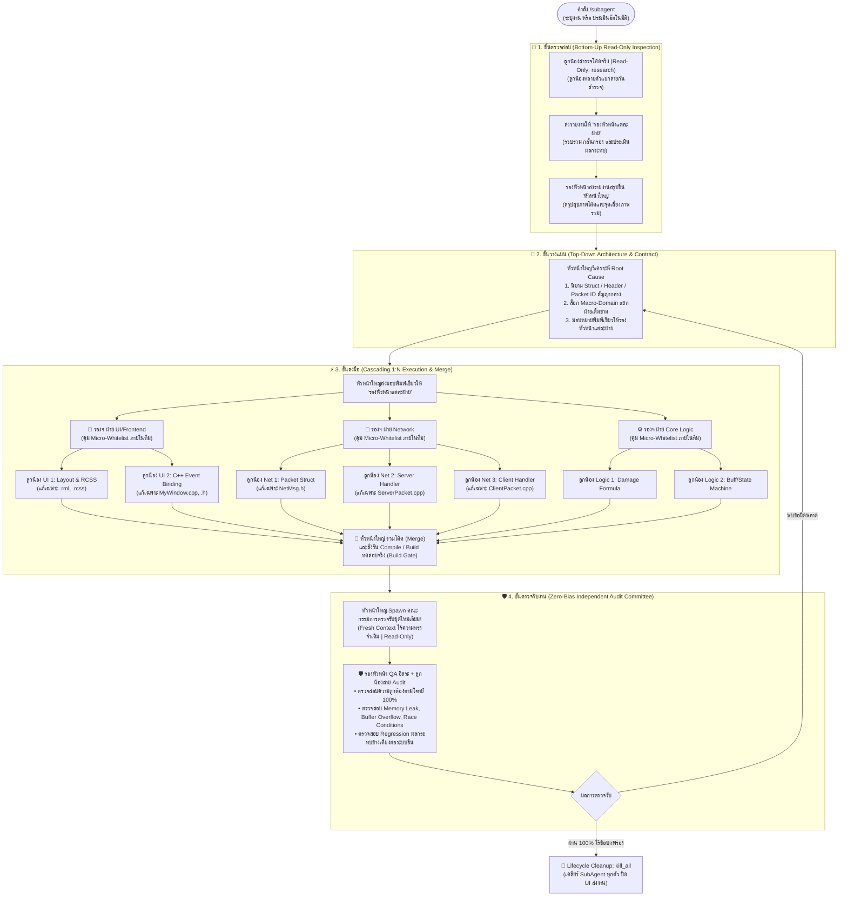

# 🏛️ 3-Tier Enterprise Multi-SubAgent Hierarchy Protocol
## (โครงสร้างพีระมิด 3 ชั้น: หัวหน้าใหญ่ ➔ รองหัวหน้า ➔ ลูกน้องหลายตัว 1:N | งานไม่ชน ไม่มั่ว ตรวจสอบ 100%)

ระบบนี้ถูกออกแบบตามโครงสร้างทีมพัฒนาซอฟต์แวร์ระดับองค์กร (Enterprise Engineering Organization) ผสานสายการบังคับบัญชาแบบทหาร (Military Hierarchy) โดยเปิดให้ **รองหัวหน้า 1 ฝ่าย สามารถแตกและควบคุมลูกน้องช่างเฉพาะทางได้หลายคนพร้อมกัน (1 Vice Lead ➔ N Specialist Workers)** โดยรองหัวหน้ามีหน้าที่เป็นผู้กำกับกรรมสิทธิ์ไฟล์ระดับย่อย (Micro-Whitelist Authority) เพื่อให้ลูกน้องในฝ่ายตนเองทำงานขนานกันได้เต็มที่โดยไม่มีการแย่งหรือแก้ไขไฟล์ทับซ้อนกัน

---

## 🔺 โครงสร้างพีระมิด 3 ชั้น (The 3-Tier Command Chain)

1. **👑 ยอดพีระมิด - หัวหน้าใหญ่ (Chief Orchestrator / Supreme Lead):**
   - คุมสถาปัตยกรรมระดับมหภาค (Macro-Architecture) วางสัญญากลาง (Interface & Struct Contract)
   - แบ่งขอบเขตระหว่างฝ่าย (Macro-Domain Partitioning) ป้องกันไม่ให้ฝ่ายใดล้ำเส้นฝ่ายอื่น
   - เป็นผู้ตัดสินใจรวมโค้ด (Merge), สั่งคอมไพล์ทดสอบ (Empirical Build Gate), และสั่งทำลายโปรเซส (`kill_all`)
2. **👥 ชั้นกลาง - รองหัวหน้าแต่ละฝ่าย (Domain Tech Leads / Vice Leads):**
   - **คุมลูกน้องในสังกัดได้หลายคนพร้อมกัน (1:N Sub-Swarm Controller)**
   - ทำหน้าที่เป็น **Micro-Whitelist Controller**: ซอยงานย่อยและล็อกไฟล์ให้ลูกน้องแต่ละคนอย่างแม่นยำ ไม่ให้ลูกน้องในฝ่ายเดียวกันแย่งแก้ไฟล์เดียวกัน
   - คัดกรองและกลั่นกรองผลงานจากลูกน้องตนเองก่อนรวมขึ้นรายงานสู่หัวหน้าใหญ่
3. **🛠️ ฐานปฏิบัติการ - ลูกน้องช่างเฉพาะทาง (Specialist Craftsmen / Feature Workers):**
   - โค้ดเดอร์ระดับปฏิบัติการที่ทำงานขนานกันหลายตัว โดยแต่ละตัวมีโฟกัสแคบและลึกมาก (Hyper-Focused)
   - ปฏิบัติตาม Whitelist ไฟล์ที่รองหัวหน้าฝ่ายตนเองล็อกไว้ให้อย่างเคร่งครัด รายงานผลกลับสู่รองหัวหน้าทันทีเมื่องานเสร็จ

---

## 🎯 กฎเหล็กและเกราะป้องกันความปลอดภัย 6 ประการ (The 6 Core Safety Guardrails)

1. **การคุมกรรมสิทธิ์ไฟล์ 2 ชั้น (Two-Tier File Whitelist - Macro & Micro):**
   - **ระดับหัวหน้าใหญ่ (Macro):** ล็อกแดนระหว่างฝ่าย (เช่น ฝ่าย UI ห้ามแตะ DB, ฝ่าย Logic ห้ามแตะ Network)
   - **ระดับรองหัวหน้า (Micro):** ในฝ่ายเดียวกัน รองหัวหน้าต้องล็อกไฟล์ให้ลูกน้องแต่ละคนแยกขาดจากกัน (เช่น ลูกน้อง UI คนที่ 1 แก้เฉพาะ `.rml`, ลูกน้อง UI คนที่ 2 แก้เฉพาะ `.cpp`)
2. **สายการบังคับบัญชาไม่ข้ามขั้น (Strict Chain of Command):**
   - ลูกน้องรายงานต่อรองหัวหน้า ➔ รองหัวหน้ารายงานต่อหัวหน้าใหญ่ ➔ หัวหน้าใหญ่เป็นผู้ประสานและตัดสินใจรวมงาน
3. **จำกัดความลึกของพีระมิดสูงสุด 3 ชั้น (Max Depth Guardrail = 3 Tiers):**
   - พีระมิดมีได้สูงสุดเพียง 3 ชั้นเท่านั้น (หัวหน้าใหญ่ ➔ รองหัวหน้า ➔ ลูกน้อง) **ห้ามลูกน้องแตกเหลนต่อเด็ดขาด** (แต่ใน 1 รองหัวหน้า สามารถมีลูกน้องกี่คนก็ได้ในแนวนอน)
4. **สิทธิ์อ่านอย่างเดียวในขั้นตอนตรวจสอบ (Enforce Read-Only in Audit Phases):**
   - ใน **ขั้นที่ 1 (ตรวจก่อนเริ่ม)** และ **ขั้นที่ 4 (ตรวจรับงาน)** ต้องบังคับใช้ `TypeName: "research"` เสมอ ห้ามใช้ `self` เพื่อรับประกันว่าทีมตรวจสอบจะอ่านโค้ดเพียงอย่างเดียวและไม่มีทางเผลอแก้ไขไฟล์โดยพลการ
5. **คณะกรรมการตรวจรับงานชุดใหม่เอี่ยม (Zero-Bias Independent Audit Committee):**
   - เมื่อทำเสร็จสิ้น **ต้อง Spawn รองหัวหน้า QA และลูกน้องชุดใหม่เอี่ยมที่ไม่มีความทรงจำเดิม** มาตรวจงาน ห้ามใช้ทีมเดิมตรวจงานตัวเองเด็ดขาด
6. **เคลียร์ทั้งระบบทันทีเมื่องานเสร็จ (Zero-Hanging & Immediate Cleanup):**
   - เมื่อผ่านการตรวจรับ หัวหน้าใหญ่ต้องเรียกคำสั่ง `manage_subagents` Action `kill_all` เคลียร์ทั้งพีระมิดทันที ป้องกัน Zombie Process หรือ Spinner หมุนค้างใน UI

---

## 🔄 แผนผังสถาปัตยกรรมการทำงาน (Orchestration Architecture)



---

## 📋 รายละเอียดการปฏิบัติงานทั้ง 4 ขั้น (Step-by-Step Instructions)

### 📌 ขั้นที่ 1: ขั้นตรวจสอบ (Bottom-Up Read-Only Inspection)
1. **ลูกน้องหลายตัวลงพื้นที่ (Read-Only: `research`):** สำรวจโค้ดตามที่รองหัวหน้าแต่ละสายสั่งการ
2. **รองหัวหน้าสังเคราะห์:** รองแต่ละฝ่ายรวบรวมรายงานจากลูกน้องของตน ตัดข้อมูลซ้ำซ้อน และจัดทำสรุปสาระสำคัญ
3. **ส่งมอบให้หัวหน้าใหญ่:** รองหัวหน้านำเสนอสรุปจุดเสี่ยงและโครงสร้างต่อหัวหน้าใหญ่

---

### 🧠 ขั้นที่ 2: ขั้นวางแผน (Top-Down Architecture & Contract Design)
1. **หัวหน้าใหญ่วางสัญญากลาง (Shared Contract):** เขียน Struct, Packet ID, Header หรือ Enum กลาง
2. **แบ่งแดน Macro-Whitelist:** กำหนดขอบเขตโฟลเดอร์/ไฟล์ให้รองหัวหน้าแต่ละฝ่ายอย่างเด็ดขาด

---

### ⚡ ขั้นที่ 3: ขั้นลงมือ (Cascading 1:N Execution & Merge)

1. **รองหัวหน้าแตกงานย่อย (Micro-Whitelist Distribution):**
   - รองหัวหน้าได้รับงานมาจากหัวหน้าใหญ่ จะนำมาซอยเป็นงานย่อยและล็อกไฟล์ให้ลูกน้องแต่ละคน **(ห้ามลูกน้อง 2 คนในทีมเดียวกันแก้ไฟล์เดียวกัน)**
2. **ลูกน้องลงมือทำคู่ขนานกัน (Parallel Execution):**
   - ลูกน้องหลายสิบคนสามารถทำงานพร้อมกันได้โดยไม่มีการเซฟทับกัน เพราะไฟล์ถูกแยกขาดจากกันทั้งในระดับฝ่าย (Macro) และในระดับบุคคล (Micro)
3. **ด่านตรวจคอมไพล์ (Empirical Build Gate):**
   - เมื่อลูกน้องทุกสายส่งงานครบ หัวหน้าใหญ่ทำการตรวจสอบความสอดคล้อง แล้ว**รันคำสั่งคอมไพล์ (Build/Compile) จริงเสมอ** เพื่อยืนยันว่าไม่มี Error ใดๆ ก่อนส่งต่อไปขั้นที่ 4

#### 💻 ตัวอย่างการเรียกใช้ช่างเฉพาะทางแบบ 1:N (Step 3):
```json
{
  "Subagents": [
    {
      "TypeName": "self",
      "Role": "UI Craftsman 1 - RCSS & Layout",
      "Prompt": "[สังกัด: รองฯ ฝ่าย UI]\nขอบเขตไฟล์ที่อนุญาตให้แก้เท่านั้น: [RanClient/UI/MyFeature.rml, MyFeature.rcss]\nจัดทำ Layout, ฟอนต์ไทย, และความสวยงามตาม Mockup\nเมื่อเสร็จแล้วให้สรุป Diff และจบเทิร์นทันที ห้ามแตะไฟล์ .cpp"
    },
    {
      "TypeName": "self",
      "Role": "UI Craftsman 2 - C++ Event Binding",
      "Prompt": "[สังกัด: รองฯ ฝ่าย UI]\nขอบเขตไฟล์ที่อนุญาตให้แก้เท่านั้น: [RanClient/UI/MyFeatureWindow.cpp, MyFeatureWindow.h]\nเชื่อม Event ปุ่มกดเข้ากับคำสั่งส่ง Packet ตามสัญญากลาง\nเมื่อเสร็จแล้วให้สรุป Diff และจบเทิร์นทันที ห้ามแตะไฟล์ .rml"
    },
    {
      "TypeName": "self",
      "Role": "Network Craftsman 1 - Packet Header",
      "Prompt": "[สังกัด: รองฯ ฝ่าย Network]\nขอบเขตไฟล์ที่อนุญาตให้แก้เท่านั้น: [RanLogic/Network/NetMsg.h]\nประกาศ Struct Packet และ Enum ID ตามสัญญากลางที่หัวหน้าใหญ่กำหนด\nเมื่อเสร็จแล้วให้สรุป Diff และจบเทิร์นทันที"
    },
    {
      "TypeName": "self",
      "Role": "Network Craftsman 2 - Server Handler",
      "Prompt": "[สังกัด: รองฯ ฝ่าย Network]\nขอบเขตไฟล์ที่อนุญาตให้แก้เท่านั้น: [RanLogic/Network/NetMsgHanderServer.cpp]\nเขียนตรรกะตรวจรับ Packet และ Validate ข้อมูลฝั่ง Server\nเมื่อเสร็จแล้วให้สรุป Diff และจบเทิร์นทันที"
    }
  ]
}
```

---

### 🛡️ ขั้นที่ 4: ขั้นตรวจรับงาน (Zero-Bias Independent Audit Committee)

> ⚠️ **MANDATORY ZERO-BIAS & READ-ONLY RULE:**
> บังคับ Spawn ทีมตรวจรับชุดใหม่เอี่ยม (`TypeName: "research"`) ปราศจากความทรงจำเดิม เพื่อตรวจ Diff รวมของลูกน้องทุกคน

1. **ตรวจสอบความสอดคล้อง:** ตรวจสอบว่าโค้ดของลูกน้องแต่ละสายเมื่อนำมาประกบกันแล้วทำงานได้ราบรื่น 100%
2. **ตรวจสอบความปลอดภัย:** ตรวจ Memory Leak, Buffer Overflow, Race Conditions, และ Regression
3. **ตัดสินผล:** หาก `PASSED` หัวหน้าใหญ่จะเข้าสู่ขั้นตอน Cleanup ทันที

---

### 🛑 กลยุทธ์การกู้คืนกรณีฉุกเฉิน (Failure, Error & Timeout Recovery)

1. **หากลูกน้องคนใดคนหนึ่งตายหรือค้าง (> 3-5 นาที):**
   - รองหัวหน้าหรือหัวหน้าใหญ่จะสั่ง `manage_subagents` Action `kill` เฉพาะ Conversation ID ของลูกน้องคนนั้นทิ้งทันที
   - จากนั้น Spawn ช่างตัวใหม่เข้ามารับช่วงต่อเฉพาะไฟล์ที่ลูกน้องคนนั้นทำค้างไว้ โดยลูกน้องคนอื่นๆ ในโปรเจกต์ยังคงทำงานต่อได้ตามปกติ ไม่สะดุด
2. **หากคอมไพล์ติด Error ที่ด่าน Build Gate:**
   - หัวหน้าใหญ่จับ Log ส่งตรงให้รองหัวหน้าที่ดูแลไฟล์ที่มี Error นั้น เพื่อให้รองสั่งลูกน้องแก้เฉพาะจุดทันที

---

### 🧹 การปิดงานและเคลียร์ทรัพยากร (Zero-Hanging Cleanup)

เมื่อคณะกรรมการตรวจรับงานอนุมัติ `PASSED`:
หัวหน้าใหญ่ต้องเรียกคำสั่งนี้ทันทีก่อนตอบผู้ใช้:
```json
{
  "Action": "kill_all"
}
```
(เรียกผ่านเครื่องมือ `manage_subagents`) เพื่อปิด SubAgent ทุกตัวในระบบ ปิดตัวหมุน (Spinner) ใน UI และคืนหน่วยความจำ 100%

---

## 🗂️ ตัวอย่างเมทริกซ์การแบ่งงานแบบ 1:N ภายในแต่ละฝ่าย

| รองหัวหน้า (Tier 2 Lead) | ลูกน้องในสังกัด (Tier 3 Workers) | Micro-Whitelist (ไฟล์ที่รับผิดชอบ) | หน้าที่เฉพาะจุด |
|---|---|---|---|
| **🎨 รองฯ ฝ่าย UI** | • ลูกน้อง 1 (Layout/RCSS)<br>• ลูกน้อง 2 (C++ Event)<br>• ลูกน้อง 3 (Localization) | `*.rml, *.rcss`<br>`MyWindow.cpp, .h`<br>`StringTable.xml` | หน้าตา/อนิเมชัน<br>คลิก/ส่งข้อมูล<br>ภาษาไทยและฟอนต์ |
| **📡 รองฯ ฝ่าย Network** | • ลูกน้อง 1 (Packet Definer)<br>• ลูกน้อง 2 (Server Handler)<br>• ลูกน้อง 3 (Client Handler) | `NetMsg.h`<br>`ServerHandler.cpp`<br>`ClientHandler.cpp` | นิยาม Struct กลาง<br>ประมวลผลเซิร์ฟเวอร์<br>รับค่ามาอัปเดตหน้าจอ |
| **⚙️ รองฯ ฝ่าย Logic** | • ลูกน้อง 1 (Formula Craftsman)<br>• ลูกน้อง 2 (State Machine) | `GLCharLogic.cpp`<br>`GLCharState.cpp` | คำนวณดาเมจ/คูลดาวน์<br>จัดการสถานะบัฟ/ดีบัฟ |
| **🗄️ รองฯ ฝ่าย Database** | • ลูกน้อง 1 (Schema & Table)<br>• ลูกน้อง 2 (Stored Procedure) | `CreateTables.sql`<br>`CharacterSave.sql` | ฟิลด์ข้อมูลใหม่<br>ตรรกะบันทึก/โหลดข้อมูล |

---

## 📝 รูปแบบรายงานผลลัพธ์ส่งมอบ (Final Delivery Report)

```markdown
# 🏛️ รายงานผลการทำงาน (3-Tier 1:N Enterprise Swarm Report)

### 1. 📌 สรุปผลการตรวจสอบ (Step 1: Inspection Summary)
- **รายงานจากรองหัวหน้าแต่ละฝ่าย:** [สรุปจุดเสี่ยงและสุขภาพโค้ดเดิม]

### 2. 🧠 สัญญากลางและการจัดสรร Micro-Whitelist (Step 2: Architecture & Contracts)
- **Shared Struct / Interface:** [ระบุ Struct หรือ Enum กลาง]
- **Department & Worker Distribution:** [แสดงรายการลูกน้องทุกคนและ Whitelist ไฟล์]

### 3. ⚡ ผลการลงมือของลูกน้องแต่ละสาย (Step 3: 1:N Cascading Execution)
- **🎨 ฝ่าย UI (N Workers):** [สรุปผลงานของลูกน้องสาย UI ทุกคน]
- **📡 ฝ่าย Network (N Workers):** [สรุปผลงานของลูกน้องสาย Network ทุกคน]
- **⚙️ ฝ่าย Core Logic (N Workers):** [สรุปผลงานของลูกน้องสาย Logic ทุกคน]
- **🗄️ ฝ่าย Database (N Workers):** [สรุปผลงานของลูกน้องสาย DB ทุกคน]
- **🔨 Empirical Build Gate:** `PASSED` (คอมไพล์ผ่าน 100% ไร้ Syntax / Linker Errors)

### 4. 🛡️ มติคณะกรรมการตรวจรับงานอิสระ (Step 4: Independent QA Committee)
- **Committee Verdict:** `PASSED` ✅ (100% Correctness, Zero Regressions)
- **Concurrency & Security:** ปลอดภัย โค้ดของลูกน้องทุกคนเชื่อมต่อกันสมบูรณ์ ไร้บั๊กชนกัน

### 5. 🧹 การปิดกระบวนการ (Lifecycle Cleanup)
- **Resource Cleanup:** `kill_all` สำเร็จ 100% ไม่มี SubAgent ค้างในหน่วยความจำ
```

---

# 🌐 English Specification & Protocol Reference

## 🏛️ 1. Architecture Overview (The 3 Tiers)

1. **👑 Tier 1 - Supreme Orchestrator (Chief Lead / Main Agent):**
   - Directs macro-architecture and project goals.
   - Authors the **Shared Contract First** (Shared Structs, Enums, Network Packet IDs, or C++ Interface Headers).
   - Enforces **Macro-Domain Partitioning** across departments (e.g., UI never touches DB).
   - Merges code branches, runs the **Empirical Build Gate** (actual compiler commands), and triggers `manage_subagents: kill_all`.
2. **👥 Tier 2 - Department Vice Leads (Domain Tech Leads):**
   - Controls multiple worker subagents concurrently (**1:N Sub-Swarm Controller**).
   - Serves as **Micro-Whitelist Controller**: Sub-divides tasks and assigns strict, non-overlapping file whitelists to individual workers to eliminate edit collisions.
   - Synthesizes findings and diffs from workers before briefing the Chief.
3. **🛠️ Tier 3 - Specialist Craftsmen (Hyper-Focused Workers):**
   - High-precision execution agents operating strictly within their assigned file whitelist.
   - Reports completed diff summaries back to their Vice Lead and yields execution immediately.
4. **🛡️ Quality Gate - Independent QA Committee (Zero-Bias Reviewers):**
   - Spawned in Step 4 with fresh, unpolluted context and **Read-Only tools** (`TypeName: "research"`) to audit combined PR diffs with zero developer confirmation bias.

---

## 🎯 2. The 6 Core Safety Guardrails

1. **Two-Tier File Whitelisting (Macro & Micro):**
   - *Macro Level:* Chief locks department boundaries (UI vs Network vs Logic vs Database).
   - *Micro Level:* Vice Lead locks individual file assignments among workers (Worker 1 gets `.rml`, Worker 2 gets `.cpp`). Zero file collisions guaranteed.
2. **Strict Chain of Command:**
   - Workers report to Vice Leads ➔ Vice Leads report to Chief ➔ Chief orchestrates integration.
3. **Max Hierarchy Depth = 3 Tiers:**
   - Depth is strictly capped at 3 tiers (Chief ➔ Vice Leads ➔ Workers). Workers are forbidden from spawning Tier 4 subagents to prevent runaway recursion and token bloat.
4. **Enforced Read-Only Audit Tools (Steps 1 & 4):**
   - Step 1 (Pre-Audit) and Step 4 (Post-Audit) must strictly utilize `TypeName: "research"`. Modifying tools are disabled to prevent accidental code mutations during inspections.
5. **Zero-Bias Independent Audit Committee:**
   - Always spawn fresh subagents for final QA review. Never reuse agents from earlier execution steps.
6. **Zero-Hanging Cleanup (`kill_all`):**
   - Mandatory invocation of `manage_subagents: kill_all` upon task approval to guarantee zero zombie background processes and eliminate UI spinner hanging.

---

## 📋 3. Step-by-Step Operational Protocol

### Step 1: Bottom-Up Read-Only Inspection
*Supports explicit goals or Autonomous Zero-Prompt execution when `/subagent` is invoked without parameters.*
- Workers perform line-by-line file inspections, scan recent Git diffs, compiler error logs, and crash dumps.
- Vice Leads aggregate findings, filter noise, and brief the Chief Orchestrator on risks and affected call graphs.

### Step 2: Top-Down Architecture & Contract Design
- Chief analyzes root cause and drafts the central API contract / shared header definitions.
- Chief partitions macro-domain boundaries for each department.

### Step 3: Cascading 1:N Execution & Empirical Build Gate
- Vice Leads distribute micro-whitelists to their respective specialist workers.
- Workers code concurrently across non-overlapping files.
- Chief merges code changes and **must execute actual build/compile commands** to empirically verify zero syntax or linker errors before progressing.

### Step 4: Zero-Bias Independent QA Review
- Chief spawns a fresh QA Committee (`TypeName: "research"`).
- QA evaluates complete diff for goal alignment, null safety, memory/buffer leaks, and regression.
- Upon `PASSED` verdict, Chief runs `manage_subagents: kill_all` and delivers final report.

---

## 🛑 4. Failure, Error & Timeout Recovery
1. **Agent Error / Crash:**
   - Chief issues `manage_subagents: kill` with the specific `ConversationId` of the failed worker.
   - Chief re-spawns a replacement specialist for that isolated scope without disrupting ongoing sibling workers.
2. **Timeout (> 3-5 Minutes):**
   - If any worker hangs without tool calls, immediately terminate via `kill`, narrow prompt scope, and re-dispatch.
3. **Compiler Build Failure:**
   - Chief isolates compiler error logs and routes them to the responsible Vice Lead for immediate hot-patching before QA is engaged.

